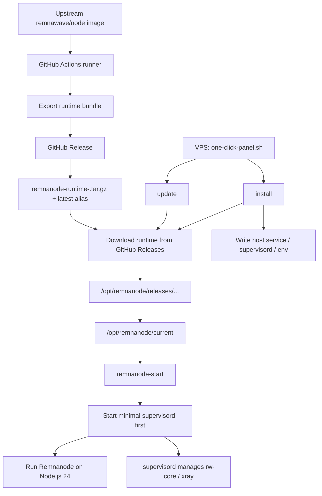

# remnanode-lite

Bare-metal Remnanode deployment for constrained Alpine and Debian VPS hosts.

Chinese version: [README.zh-CN.md](README.zh-CN.md)

## Architecture



The current repository is designed to match the new architecture:

- GitHub Actions runs only on GitHub's runner
- the runner only exports and publishes the upstream Remnanode runtime bundle
- the runner does not SSH into the VPS
- the VPS pulls either the latest runtime alias or a versioned runtime bundle from GitHub Releases by itself
- `install` writes host-local service, supervisord, and env files
- `update` refreshes host-side service files, pulls a newer runtime, switches the active release, and restarts the services

## Quick Start

Install `curl` first:

Alpine:

```sh
apk add --no-cache curl
```

Debian:

```sh
apt-get update && apt-get install -y --no-install-recommends curl ca-certificates
```

Interactive TUI panel:

```sh
curl -fsSL -o /root/one-click-panel.sh \
  https://raw.githubusercontent.com/x-socks/remnanode-lite/main/scripts/one-click-panel.sh && \
sh /root/one-click-panel.sh
```

Direct install:

```sh
curl -fsSL -o /root/one-click-panel.sh \
  https://raw.githubusercontent.com/x-socks/remnanode-lite/main/scripts/one-click-panel.sh && \
sh /root/one-click-panel.sh install
```

Direct install with a pinned runtime version:

```sh
curl -fsSL -o /root/one-click-panel.sh \
  https://raw.githubusercontent.com/x-socks/remnanode-lite/main/scripts/one-click-panel.sh && \
RUNTIME_VERSION=2.6.1 sh /root/one-click-panel.sh install
```

Direct update:

```sh
curl -fsSL -o /root/one-click-panel.sh \
  https://raw.githubusercontent.com/x-socks/remnanode-lite/main/scripts/one-click-panel.sh && \
sh /root/one-click-panel.sh update
```

Direct Xray core update:

```sh
curl -fsSL -o /root/one-click-panel.sh \
  https://raw.githubusercontent.com/x-socks/remnanode-lite/main/scripts/one-click-panel.sh && \
sh /root/one-click-panel.sh update-xray
```

Interactive TUI capabilities:

- startup snapshot of node status, runtime version, node port, Xray core version, IP, CPU load, memory, and disk usage
- service actions: install, start, stop, restart, uninstall
- log views: service logs, Xray output logs, Xray error logs
- maintenance actions: update remnanode-lite, update xray-core, edit configuration
- after install or update, the script installs `/usr/local/bin/remnanode`, so you can open the TUI from any directory with `remnanode`

## Parameters

The one-click scripts support both positional arguments and environment variables.

### `scripts/one-click-panel.sh`

Positional arguments:

- `ACTION`: `auto` by default. Supported values: `auto`, `install`, `update`, `tui`, `start`, `stop`, `restart`, `status`, `logs`, `xray-log`, `xray-err`, `update-xray`, `edit-config`, `uninstall`.
- `REPO_SLUG`: `x-socks/remnanode-lite` by default.
- `REPO_REF`: `main` by default.
- `RUNTIME_VERSION`: `latest` by default.

Environment variables:

- `ACTION=auto`: open the TUI when running interactively; auto-detect `install` or `update` in non-interactive mode.
- `REPO_SLUG=x-socks/remnanode-lite`: GitHub repository used for raw script downloads and release pulls.
- `REPO_REF=main`: Git ref used when downloading `one-click-deploy.sh` or `one-click-upgrade.sh`.
- `RUNTIME_VERSION=latest`: runtime selector. Use `latest` for the newest published bundle, or a concrete release version such as `2.6.1` when versioned assets exist.
- `BASE_DIR=/opt/remnanode`: current release root on the VPS. Non-default values are not fully supported because the generated service files still assume `/opt/remnanode/current`.
- `PANEL_INSTALL_DIR=/usr/local/lib/remnanode`: install location used for the persistent `remnanode` command wrapper.

Additional management actions:

- `tui`: open the full-screen management panel directly.
- `status`: print the current dashboard and service status once.
- `logs`: print recent Remnanode service logs.
- `xray-log`: print recent Xray stdout logs.
- `xray-err`: print recent Xray stderr logs.
- `update-xray`: download and replace the local Xray core only.
- `edit-config`: open `/etc/remnanode/remnanode.env`, `/etc/xray/config.json`, or `/etc/remnanode/github-release.env` in `$EDITOR`.
- `uninstall`: remove remnanode-lite, generated configs, logs, runtime files, and the locally managed Xray binaries.

Platform dispatch:

- Alpine hosts are detected via `/etc/alpine-release`.
- Debian hosts are detected via `/etc/debian_version` plus `systemctl`.
- `one-click-deploy.sh` and `one-click-upgrade.sh` dispatch to platform-specific implementations after detection.

### `scripts/one-click-deploy.sh`

Positional arguments:

- `REPO_SLUG`: `x-socks/remnanode-lite` by default.
- `RUNTIME_VERSION`: unset by default, resolved to `latest`.

Environment variables:

- `REPO_SLUG=x-socks/remnanode-lite`
- `BASE_DIR=/opt/remnanode`: current release root. Keep the default unless you are also updating the generated service files that still point at `/opt/remnanode/current`.
- `RUNTIME_VERSION=latest`
- `RUNTIME_ASSET_NAME=`: auto-derived from `RUNTIME_VERSION`.
- `RUNTIME_RELEASE_TAG=`: auto-derived from `RUNTIME_VERSION`.
- `NODE_PORT=`: required unless entered interactively.
- `SECRET_INPUT=`: required unless entered interactively. Accepts either the raw panel secret or `SECRET_KEY=...`.
- `INTERNAL_REST_TOKEN=`: auto-generated if empty.
- `INTERNAL_SOCKET_PATH=/run/remnanode-internal.sock`
- `SUPERVISORD_USER=`: auto-generated if empty.
- `SUPERVISORD_PASSWORD=`: auto-generated if empty.
- `SUPERVISORD_SOCKET_PATH=/run/supervisord.sock`
- `SUPERVISORD_PID_PATH=/run/supervisord.pid`

Default runtime env written by install:

- `NODE_OPTIONS='--max-http-header-size=32768 --max-old-space-size=48 --max-semi-space-size=1'`
- `MALLOC_ARENA_MAX=1`
- `UV_THREADPOOL_SIZE=1`
- `REMNANODE_ULIMIT_NOFILE=65535`

### `scripts/one-click-upgrade.sh`

Positional arguments:

- `REPO_SLUG`: `x-socks/remnanode-lite` by default.
- `RUNTIME_VERSION`: unset by default, resolved from saved release config or `latest`.

Environment variables:

- `GITHUB_RELEASE_ENV_FILE=/etc/remnanode/github-release.env`
- `REPO_SLUG=x-socks/remnanode-lite`
- `BASE_DIR=/opt/remnanode`: current release root. Keep the default unless you are also updating the generated service files that still point at `/opt/remnanode/current`.
- `RUNTIME_VERSION=latest`
- `RUNTIME_ASSET_NAME=`: auto-derived when not set.
- `RUNTIME_RELEASE_TAG=`: auto-derived when not set.
- `REMNANODE_ENV_FILE=/etc/remnanode/remnanode.env`
- `INTERNAL_REST_TOKEN=`: reused from `remnanode.env`, auto-generated if missing.
- `INTERNAL_SOCKET_PATH=/run/remnanode-internal.sock`
- `SUPERVISORD_USER=`: reused from `remnanode.env`, auto-generated if missing.
- `SUPERVISORD_PASSWORD=`: reused from `remnanode.env`, auto-generated if missing.
- `SUPERVISORD_SOCKET_PATH=/run/supervisord.sock`
- `SUPERVISORD_PID_PATH=/run/supervisord.pid`

### Saved host config files

`/etc/remnanode/github-release.env` defaults:

- `REPO_SLUG=owner/repo`
- `RUNTIME_VERSION=latest`
- `BASE_DIR=/opt/remnanode`

`/etc/remnanode/remnanode.env` template defaults:

- `REMNANODE_APP_DIR=/opt/remnanode/current`
- `REMNANODE_ENTRYPOINT=dist/src/main.js`
- `REMNANODE_ENV=production`
- `NODE_PORT=20481`
- `XTLS_API_PORT=61000`
- `XRAY_BIN=/usr/local/bin/xray`
- `XRAY_CONFIG=/etc/xray/config.json`
- `XRAY_ASSET_DIR=/usr/local/share/xray`
- `REMNANODE_ULIMIT_NOFILE=65535`

`BASE_DIR` only changes where release bundles are stored. The generated service files and `REMNANODE_APP_DIR` still target `/opt/remnanode/current`.

## Runtime Model

Current supported host families:

- Alpine Linux `3.23.x` with OpenRC
- Debian with `systemd`

Validated runtime characteristics:

- `128 MB` RAM is now the experimental floor; `256 MB` remains the safer baseline
- no swap
- NAT networking with only a small high-port window available
- Node.js `24.x`
- Xray installed locally as `/usr/local/bin/xray` and `/usr/local/bin/rw-core`
- host-local `remnanode` service running as `root:root`
- `supervisord` present on the host as a compatibility control plane

Current required runtime variables:

- `NODE_PORT`
- `SECRET_KEY`

## Current Entrypoints

Only these scripts are part of the current architecture:

- `scripts/export-runtime-bundle.sh`
- `scripts/one-click-panel.sh`
- `scripts/one-click-deploy.sh`
- `scripts/one-click-upgrade.sh`

Implementation split:

- `scripts/one-click-deploy.sh` / `scripts/one-click-upgrade.sh`: shared dispatchers
- `scripts/one-click-deploy-alpine.sh` / `scripts/one-click-upgrade-alpine.sh`: Alpine implementations
- `scripts/one-click-deploy-debian.sh` / `scripts/one-click-upgrade-debian.sh`: Debian implementations

## Conformance Check

Current practice matches the target architecture:

- [`.github/workflows/runtime-bundle.yml`](.github/workflows/runtime-bundle.yml) only exports and publishes release assets
- [`scripts/one-click-panel.sh`](scripts/one-click-panel.sh) only chooses `install` or `update` and downloads the matching host-side script
- [`scripts/one-click-deploy.sh`](scripts/one-click-deploy.sh) detects Alpine vs Debian, dispatches to the host-specific installer, and preserves the shared public entrypoint
- [`scripts/one-click-upgrade.sh`](scripts/one-click-upgrade.sh) detects Alpine vs Debian, dispatches to the host-specific upgrader, and preserves the shared public entrypoint
- [`scripts/one-click-deploy-alpine.sh`](scripts/one-click-deploy-alpine.sh) installs host dependencies, writes local OpenRC and minimal supervisord config, downloads the selected runtime from GitHub Releases, and starts the service
- [`scripts/one-click-upgrade-alpine.sh`](scripts/one-click-upgrade-alpine.sh) refreshes Alpine host-side service files, downloads the selected runtime from GitHub Releases, installs it into a new release directory, switches `current`, and restarts `remnanode`
- [`scripts/one-click-deploy-debian.sh`](scripts/one-click-deploy-debian.sh) installs host dependencies, writes local systemd and minimal supervisord config, downloads the selected runtime from GitHub Releases, and starts the service
- [`scripts/one-click-upgrade-debian.sh`](scripts/one-click-upgrade-debian.sh) refreshes Debian host-side service files, downloads the selected runtime from GitHub Releases, installs it into a new release directory, switches `current`, and restarts `remnanode`

One minor implementation detail:

- `one-click-panel.sh` still downloads `one-click-deploy.sh` or `one-click-upgrade.sh` from GitHub Raw before executing them on the VPS
- those dispatchers may then download the platform-specific Alpine or Debian implementation when it is not already present locally
- this still fits the new model, because the runner is not connecting to the VPS; the VPS is pulling what it needs itself

## Docs

- [docs/alpine-bare-metal.md](docs/alpine-bare-metal.md)
- [docs/debian-bare-metal.md](docs/debian-bare-metal.md)
- [docs/runtime-bundle-workflow.md](docs/runtime-bundle-workflow.md)
- [docs/github-actions.md](docs/github-actions.md)
- [README.zh-CN.md](README.zh-CN.md)
