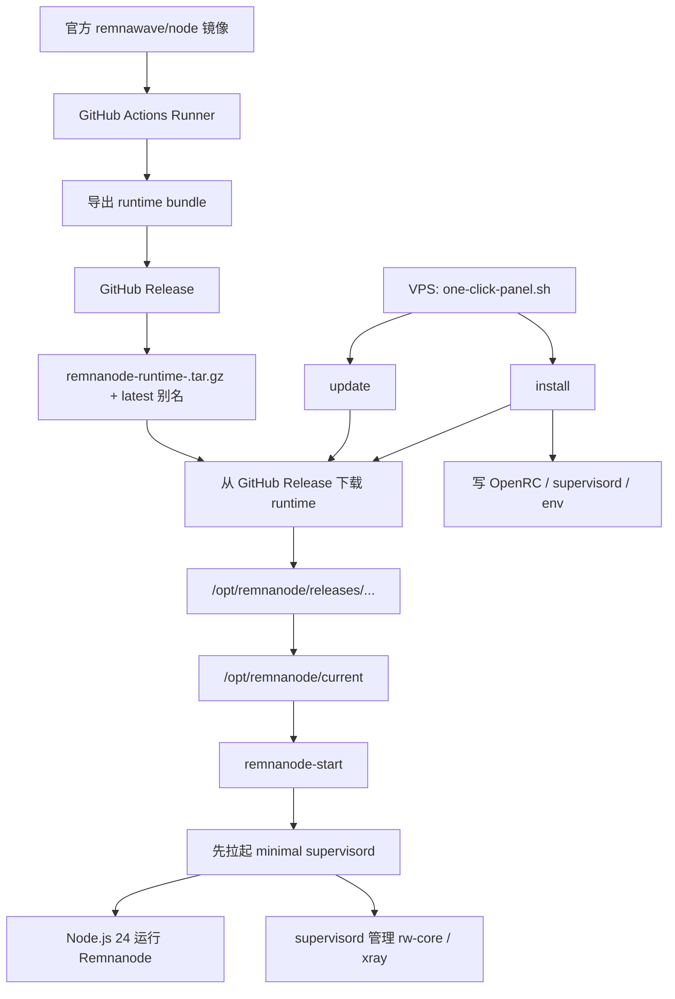

# remnanode-lite

Bare-metal Remnanode deployment for extremely constrained Alpine LXC VPS hosts.

## Architecture



The current repository is designed to match the new architecture:

- GitHub Actions runs only on GitHub's runner
- the runner only exports and publishes the upstream Remnanode runtime bundle
- the runner does not SSH into the VPS
- the VPS pulls either the latest runtime alias or a versioned runtime bundle from GitHub Releases by itself
- `install` writes host-local OpenRC, supervisord, and env files
- `update` refreshes host-side service files, pulls a newer runtime, switches the active release, and restarts the services

## Quick Start

Interactive panel:

```sh
apk add --no-cache curl && \
curl -fsSL -o /root/one-click-panel.sh \
  https://raw.githubusercontent.com/x-socks/remnanode-lite/main/scripts/one-click-panel.sh && \
sh /root/one-click-panel.sh
```

Direct install:

```sh
apk add --no-cache curl && \
curl -fsSL -o /root/one-click-panel.sh \
  https://raw.githubusercontent.com/x-socks/remnanode-lite/main/scripts/one-click-panel.sh && \
sh /root/one-click-panel.sh install
```

Direct install with a pinned runtime version:

```sh
apk add --no-cache curl && \
curl -fsSL -o /root/one-click-panel.sh \
  https://raw.githubusercontent.com/x-socks/remnanode-lite/main/scripts/one-click-panel.sh && \
RUNTIME_VERSION=2.6.1 sh /root/one-click-panel.sh install
```

Direct update:

```sh
apk add --no-cache curl && \
curl -fsSL -o /root/one-click-panel.sh \
  https://raw.githubusercontent.com/x-socks/remnanode-lite/main/scripts/one-click-panel.sh && \
sh /root/one-click-panel.sh update
```

## Runtime Model

Validated target state:

- Alpine Linux `3.23.x` with OpenRC
- `128 MB` RAM is now the experimental floor; `256 MB` remains the safer baseline
- no swap
- NAT networking with only a small high-port window available
- Node.js `24.x`
- Xray installed locally as `/usr/local/bin/xray` and `/usr/local/bin/rw-core`
- OpenRC `remnanode` service running as `root:root`
- `supervisord` present on the host as a compatibility control plane

Current required runtime variables:

- `NODE_PORT`
- `SECRET_KEY`

## Current Entrypoints

Only these scripts are part of the current architecture:

- `scripts/export-runtime-bundle.sh`
- `scripts/one-click-panel.sh`
- `scripts/one-click-deploy.sh`
- `scripts/one-click-upgrade.sh`

## Conformance Check

Current practice matches the target architecture:

- [`.github/workflows/runtime-bundle.yml`](.github/workflows/runtime-bundle.yml) only exports and publishes release assets
- [`scripts/one-click-panel.sh`](scripts/one-click-panel.sh) only chooses `install` or `update` and downloads the matching host-side script
- [`scripts/one-click-deploy.sh`](scripts/one-click-deploy.sh) installs host dependencies, writes local OpenRC and minimal supervisord config, downloads the selected runtime from GitHub Releases, and starts the service
- [`scripts/one-click-upgrade.sh`](scripts/one-click-upgrade.sh) refreshes host-side service files, downloads the selected runtime from GitHub Releases, installs it into a new release directory, switches `current`, and restarts `remnanode`

One minor implementation detail:

- `one-click-panel.sh` still downloads `one-click-deploy.sh` or `one-click-upgrade.sh` from GitHub Raw before executing them on the VPS
- this still fits the new model, because the runner is not connecting to the VPS; the VPS is pulling what it needs itself

## Docs

- [docs/alpine-bare-metal.md](docs/alpine-bare-metal.md)
- [docs/runtime-bundle-workflow.md](docs/runtime-bundle-workflow.md)
- [docs/github-actions.md](docs/github-actions.md)
