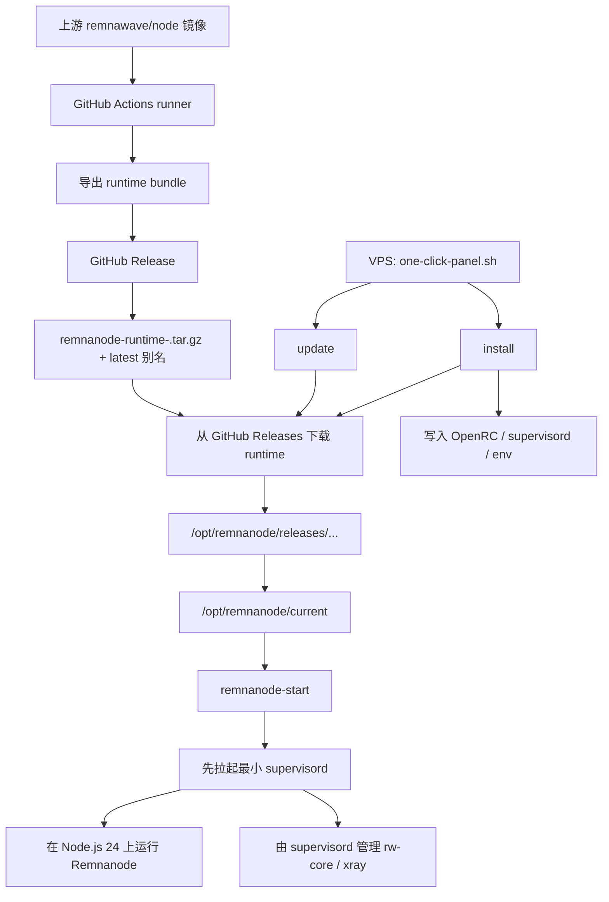

# remnanode-lite

面向极限资源 Alpine LXC VPS 的 Remnanode 裸机部署方案。

English version: [README.md](README.md)

## 架构



当前仓库对应的部署模型：

- GitHub Actions 只负责导出和发布 runtime bundle。
- runner 不会 SSH 到 VPS。
- VPS 自己从 GitHub Releases 拉取 `latest` 或指定版本的 runtime。
- `install` 负责写本地 OpenRC、supervisord 和 env 文件。
- `update` 负责刷新宿主机脚本、切换 runtime 版本并重启服务。

## 快速开始

交互式面板：

```sh
apk add --no-cache curl && \
curl -fsSL -o /root/one-click-panel.sh \
  https://raw.githubusercontent.com/x-socks/remnanode-lite/main/scripts/one-click-panel.sh && \
sh /root/one-click-panel.sh
```

直接安装：

```sh
apk add --no-cache curl && \
curl -fsSL -o /root/one-click-panel.sh \
  https://raw.githubusercontent.com/x-socks/remnanode-lite/main/scripts/one-click-panel.sh && \
sh /root/one-click-panel.sh install
```

指定 runtime 版本安装：

```sh
apk add --no-cache curl && \
curl -fsSL -o /root/one-click-panel.sh \
  https://raw.githubusercontent.com/x-socks/remnanode-lite/main/scripts/one-click-panel.sh && \
RUNTIME_VERSION=2.6.1 sh /root/one-click-panel.sh install
```

直接更新：

```sh
apk add --no-cache curl && \
curl -fsSL -o /root/one-click-panel.sh \
  https://raw.githubusercontent.com/x-socks/remnanode-lite/main/scripts/one-click-panel.sh && \
sh /root/one-click-panel.sh update
```

## 参数说明

一键脚本同时支持位置参数和环境变量。

### `scripts/one-click-panel.sh`

位置参数：

- `ACTION`：默认 `auto`，支持 `auto`、`install`、`update`
- `REPO_SLUG`：默认 `x-socks/remnanode-lite`
- `REPO_REF`：默认 `main`
- `RUNTIME_VERSION`：默认 `latest`

环境变量：

- `ACTION=auto`：自动判断执行安装还是更新
- `REPO_SLUG=x-socks/remnanode-lite`：用于下载 raw 脚本和 GitHub Release 资产的仓库
- `REPO_REF=main`：下载 `one-click-deploy.sh` / `one-click-upgrade.sh` 时使用的 Git ref
- `RUNTIME_VERSION=latest`：runtime 选择器。`latest` 表示最新发布版本；如果已有版本化资产，也可以填具体版本如 `2.6.1`
- `BASE_DIR=/opt/remnanode`：当前 release 根目录。暂不完整支持非默认值，因为生成出来的服务文件仍固定使用 `/opt/remnanode/current`

### `scripts/one-click-deploy.sh`

位置参数：

- `REPO_SLUG`：默认 `x-socks/remnanode-lite`
- `RUNTIME_VERSION`：默认空，最终会解析成 `latest`

环境变量：

- `REPO_SLUG=x-socks/remnanode-lite`
- `BASE_DIR=/opt/remnanode`：当前 release 根目录。除非你会同步修改仍指向 `/opt/remnanode/current` 的服务文件，否则应保持默认值
- `RUNTIME_VERSION=latest`
- `RUNTIME_ASSET_NAME=`：默认按 `RUNTIME_VERSION` 自动推导
- `RUNTIME_RELEASE_TAG=`：默认按 `RUNTIME_VERSION` 自动推导
- `NODE_PORT=`：必填，除非交互输入
- `SECRET_INPUT=`：必填，除非交互输入。支持原始 secret 或 `SECRET_KEY=...`
- `INTERNAL_REST_TOKEN=`：为空时自动生成
- `INTERNAL_SOCKET_PATH=/run/remnanode-internal.sock`
- `SUPERVISORD_USER=`：为空时自动生成
- `SUPERVISORD_PASSWORD=`：为空时自动生成
- `SUPERVISORD_SOCKET_PATH=/run/supervisord.sock`
- `SUPERVISORD_PID_PATH=/run/supervisord.pid`

安装时写入的默认运行时参数：

- `NODE_OPTIONS='--max-http-header-size=32768 --max-old-space-size=48 --max-semi-space-size=1'`
- `MALLOC_ARENA_MAX=1`
- `UV_THREADPOOL_SIZE=1`
- `REMNANODE_ULIMIT_NOFILE=65535`

### `scripts/one-click-upgrade.sh`

位置参数：

- `REPO_SLUG`：默认 `x-socks/remnanode-lite`
- `RUNTIME_VERSION`：默认空，优先从已保存配置解析，否则回退到 `latest`

环境变量：

- `GITHUB_RELEASE_ENV_FILE=/etc/remnanode/github-release.env`
- `REPO_SLUG=x-socks/remnanode-lite`
- `BASE_DIR=/opt/remnanode`：当前 release 根目录。除非你会同步修改仍指向 `/opt/remnanode/current` 的服务文件，否则应保持默认值
- `RUNTIME_VERSION=latest`
- `RUNTIME_ASSET_NAME=`：未设置时自动推导
- `RUNTIME_RELEASE_TAG=`：未设置时自动推导
- `REMNANODE_ENV_FILE=/etc/remnanode/remnanode.env`
- `INTERNAL_REST_TOKEN=`：默认复用 `remnanode.env` 中已有值，缺失时自动生成
- `INTERNAL_SOCKET_PATH=/run/remnanode-internal.sock`
- `SUPERVISORD_USER=`：默认复用 `remnanode.env` 中已有值，缺失时自动生成
- `SUPERVISORD_PASSWORD=`：默认复用 `remnanode.env` 中已有值，缺失时自动生成
- `SUPERVISORD_SOCKET_PATH=/run/supervisord.sock`
- `SUPERVISORD_PID_PATH=/run/supervisord.pid`

### 宿主机落盘配置

`/etc/remnanode/github-release.env` 默认值：

- `REPO_SLUG=owner/repo`
- `RUNTIME_VERSION=latest`
- `BASE_DIR=/opt/remnanode`

`/etc/remnanode/remnanode.env` 模板默认值：

- `REMNANODE_APP_DIR=/opt/remnanode/current`
- `REMNANODE_ENTRYPOINT=dist/src/main.js`
- `REMNANODE_ENV=production`
- `NODE_PORT=20481`
- `XTLS_API_PORT=61000`
- `XRAY_BIN=/usr/local/bin/xray`
- `XRAY_CONFIG=/etc/xray/config.json`
- `XRAY_ASSET_DIR=/usr/local/share/xray`
- `REMNANODE_ULIMIT_NOFILE=65535`

`BASE_DIR` 只会改变 release bundle 的存放位置；生成出来的 OpenRC 服务和 `REMNANODE_APP_DIR` 仍然固定指向 `/opt/remnanode/current`。

## 运行模型

当前验证过的目标状态：

- Alpine Linux `3.23.x` + OpenRC
- `128 MB` 目前仍然是实验下限，`256 MB` 更稳
- 无 swap 更容易暴露内存问题
- NAT 网络环境，小范围高位端口可用
- Node.js `24.x`
- Xray 安装在本地 `/usr/local/bin/xray`
- `/usr/local/bin/rw-core -> /usr/local/bin/xray`
- OpenRC `remnanode` 服务以 `root:root` 运行
- `supervisord` 仍作为兼容控制平面保留

当前最少必填变量：

- `NODE_PORT`
- `SECRET_KEY`

## 当前入口脚本

- `scripts/export-runtime-bundle.sh`
- `scripts/one-click-panel.sh`
- `scripts/one-click-deploy.sh`
- `scripts/one-click-upgrade.sh`

## 说明文档

- [docs/alpine-bare-metal.md](docs/alpine-bare-metal.md)
- [docs/runtime-bundle-workflow.md](docs/runtime-bundle-workflow.md)
- [docs/github-actions.md](docs/github-actions.md)
- [README.md](README.md)
